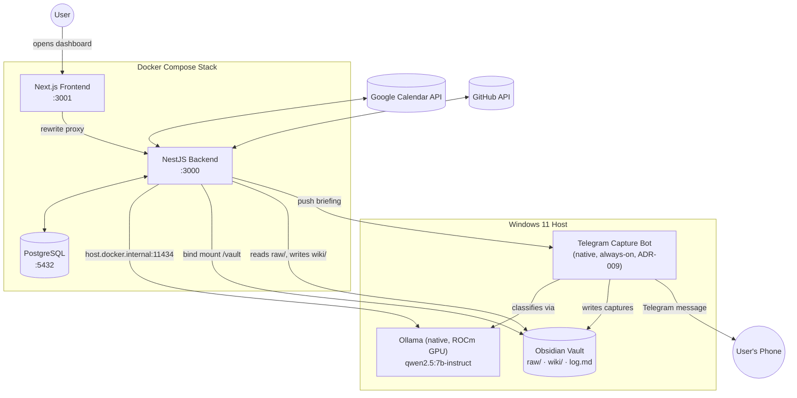

# My Pensieve

A privacy-first, local-first personal operating system: an executive briefing engine and personal knowledge management (PKM) platform that runs on your own hardware, with your own local LLM, and never sends your calendar, notes, or projects to a third party for inference.

It is not another chatbot. It exists to reduce the amount of thinking its single user repeats every day — surfacing the day's schedule, free time, and project priorities every morning, and turning captured links, notes, and repos into a structured, browsable Obsidian vault, all without a cron job or a cloud dependency in sight.

Built for one user, on one machine (Windows 11, AMD ROCm GPU) — there is no multi-tenancy, no `User` table, no account system.

## Core Philosophy

- **Privacy-first.** All LLM inference runs locally via Ollama. No prompt, note, or calendar event is ever sent to an external AI API.
- **Local-first storage.** Structured data lives in a Postgres instance you run yourself; unstructured knowledge lives in a plain-text Obsidian vault on your filesystem — both fully yours, both fully inspectable.
- **On-demand, not always-on.** With one deliberate exception (the Telegram Capture Bot, see [ADR-009](docs/adr/009-capture-bot.md)), nothing runs on a schedule. Freshness is tied to the moment you open the dashboard: `POST /x/sync` → `GET /x`.
- **Graceful degradation.** A failed external call (Google Calendar, Ollama) never produces a blank screen — it shows a clear warning alongside the last known good data ([ADR-010](docs/adr/010-graceful-degradation.md)).
- **Zero cloud lock-in.** Docker Compose owns Postgres, the backend, and the frontend. Nothing about the core stack requires an external account beyond Google Calendar OAuth.

## Key Capabilities

### Executive Briefing Engine
Aggregates the day's Google Calendar schedule, ranks project priorities, computes free time between events (correctly excluding all-day events, which would otherwise zero out the calculation), and generates a short natural-language narration of the day via a local LLM. Deterministic prioritization and free-time math are pre-computed in TypeScript — the LLM is only ever handed already-formatted values to narrate, never asked to do arithmetic itself. Fast (schedule/priorities) and slow (LLM narration) data are served from two separate endpoints, fetched independently by the frontend, so a slow model never blocks a page render.

### Knowledge Ingestion & Vault Sync
A Knowledge Inbox pipeline ingests raw captures from multiple sources — freeform text, GitHub repositories (via the GitHub API, README + commit history), and whatever the Telegram Capture Bot has classified and dropped into the vault — and turns them into structured Obsidian markdown pages. Follows Karpathy's `raw/` → `wiki/` → `log.md` pattern ([ADR-008](docs/adr/008-karpathy-raw-wiki-pattern.md)): raw captures are never mutated, generated wiki pages are derived and regeneratable, and a running log records what happened. Sync is manually triggered from the dashboard, with freshness indicators showing what's stale.

### Local LLM Inference, Zero Cloud Cost
All generation and classification — briefing narration, capture classification, wiki summarization — runs through a single native Ollama instance (`qwen2.5:7b-instruct`) on the host's GPU. Ollama is deliberately **never containerized** ([ADR-003](docs/adr/003-deployment-on-demand-ollama-native.md)): on Windows, GPU passthrough into Docker adds friction that native ROCm doesn't need. Containers reach it via `host.docker.internal:11434`.

### Containerized Application Stack
Postgres, the NestJS backend, and the Next.js frontend are fully orchestrated with Docker Compose — build, start, restart, and log-tail as one unit. The Obsidian vault directory is bind-mounted into the backend container so it stays a plain folder on your filesystem, editable directly or by the natively-running Capture Bot.

### Always-On Telegram Capture Bot
The one exception to "on-demand only": a small, independently-restartable Node/TypeScript process ([ADR-009](docs/adr/009-capture-bot.md)) that listens continuously for links, images, and notes sent via Telegram, classifies them with the local LLM, and writes them into the vault's `raw/` for the Knowledge Inbox pipeline to pick up later. The same bot delivers the generated morning briefing back to your phone as a push message ([ADR-006](docs/adr/006-telegram-briefing-delivery.md)), rather than exposing the dashboard publicly.

## Tech Stack

| Layer | Technology |
|---|---|
| **Backend** | NestJS 11 (TypeScript), Prisma ORM, PostgreSQL 16 |
| **Frontend** | Next.js (App Router), React 19, TypeScript, Tailwind CSS v4, shadcn/ui |
| **Inference** | Ollama, `qwen2.5:7b-instruct` (native on host, ROCm/CUDA GPU) |
| **Integrations** | Google Calendar API (OAuth2), GitHub API (Octokit), Telegram Bot API |
| **Infra** | Docker & Docker Compose (Postgres, backend, frontend), multi-stage Node 22 Alpine builds |
| **Knowledge Store** | Obsidian-compatible markdown vault (`raw/`, `wiki/`, `log.md`) on the host filesystem |

## System Architecture



## Getting Started

### Prerequisites

- [Docker Desktop](https://www.docker.com/products/docker-desktop/)
- Node.js v22+ (only needed if running the Capture Bot or frontend/backend natively outside Compose)
- A running local Ollama instance with the model pulled:
  ```bash
  ollama pull qwen2.5:7b-instruct
  ollama run qwen2.5:7b-instruct
  ```
- A Google Cloud OAuth client (Calendar API) for calendar sync
- A Telegram bot token, if you want capture/briefing-push functionality

### Environment Configuration

Three `.env` files are involved — copy each example and fill in real values:

```bash
cp .env.example .env                          # Postgres creds, ports, VAULT_HOST_PATH
cp backend/.env.example backend/.env          # Google OAuth, Telegram, GitHub token
cp frontend/.env.example frontend/.env        # backend origin for the Next.js rewrite proxy
```

`VAULT_HOST_PATH` in the root `.env` must point at the **same** Obsidian vault directory the Capture Bot uses (`capture-bot/.env`) — it gets bind-mounted into the backend container at `/vault`.

### One-Command Startup

```bash
git clone <repo-url>
cd my-pensieve
cp .env.example .env
cp backend/.env.example backend/.env
docker compose up --build -d
```

- Frontend: [http://localhost:3001](http://localhost:3001)
- Backend API: [http://localhost:3000](http://localhost:3000)
- Tail backend logs: `docker compose logs -f backend`

Ollama must already be running natively on the host before the stack comes up — it is not started by Compose. The Capture Bot is also not part of Compose and is started separately:

```bash
cd capture-bot
npm install
cp .env.example .env
npm run build && npm start
```

## Repository Structure

```
my-pensieve/
├── backend/                  # NestJS 11 API — modular monolith
│   ├── src/modules/
│   │   ├── calendar/         # Google Calendar sync, free-time calculation
│   │   ├── study/            # Manual-input study planner
│   │   ├── projects/         # Project tracking & priority ranking
│   │   ├── briefing/         # Daily briefing: prioritization + LLM narration
│   │   ├── knowledge/        # Knowledge Inbox: vault scan → wiki generation
│   │   └── ollama/           # Shared local-LLM client
│   ├── prisma/                # schema.prisma, migrations
│   └── Dockerfile
├── frontend/                  # Next.js App Router dashboard
│   ├── app/                   # Routes (App Router)
│   ├── components/dashboard/  # Calendar, study, projects, briefing, knowledge sections
│   └── Dockerfile
├── capture-bot/               # Standalone always-on Telegram listener (native, not containerized)
├── docs/
│   ├── architecture.md        # System overview & on-demand sync pattern
│   ├── data-model.md          # Entity definitions (verify against schema.prisma)
│   └── adr/                   # Architecture Decision Records (001–018)
├── docker-compose.yml         # Postgres + backend + frontend
└── .env.example                # Root-level Compose environment
```

## Architecture Decisions

Every non-obvious design choice — why Ollama stays native, why the Capture Bot is the one always-on exception, why free time excludes all-day events — is recorded as an ADR in [`docs/adr/`](docs/adr/README.md). Read the relevant one before making a change that might conflict with it.
