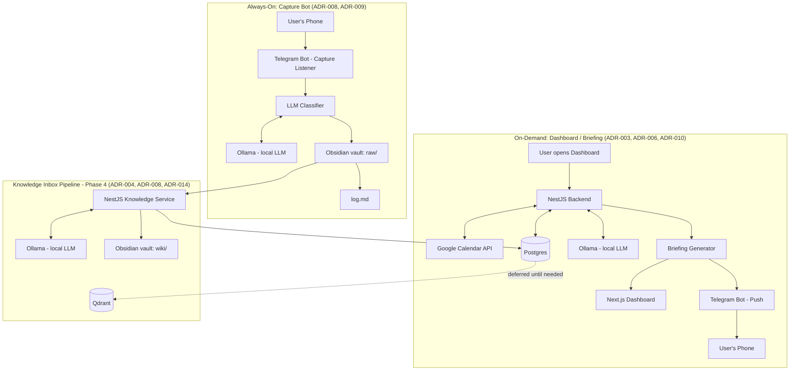

# Architecture

The original vision described a single linear pipeline:
`Sources → Collection → Processing → Knowledge Base → Orchestrator →
Dashboard → Agent Layer`. That no longer reflects reality. The system now has
**two distinct entry points** that run on different schedules, plus a
processing pipeline that connects them. See ADR-003 and ADR-009 for why.

## Overview

## Components

| Component | Role | Governing ADR(s) |
|---|---|---|
| Next.js Dashboard | On-demand UI: calendar, study, projects, knowledge inbox | — |
| NestJS Backend | Modular monolith; owns Calendar, Study, Project, Briefing, Knowledge modules | 001, 002 |
| Postgres | System of record for all structured data | 016 |
| Qdrant | Semantic search — **not yet introduced** | 004 |
| Ollama | Local LLM inference — briefing narration, classification, vision captioning, wiki summarization | 003 |
| Briefing Generator | Rule-based prioritization + LLM narration; degrades gracefully on partial data | 010 |
| Telegram Bot (Push) | Delivers the generated briefing to the user's phone | 006 |
| Telegram Bot (Capture) | Always-on listener; classifies inbound links/images/text, writes to vault `raw/` | 008, 009 |
| Obsidian Vault (`raw/`, `wiki/`, `log.md`) | Local-first knowledge store; human-browsable and pipeline-readable | 008 |
| Agent Layer (Hermes/OpenClaw) | **Not yet integrated** — Phase 7 | 005 |

## Why two entry points instead of one pipeline

Everything else in the system (dashboard, briefing, calendar sync) is
**on-demand** — it runs when the user opens the app, with no requirement to
be always-on (ADR-003). The Capture Bot is the one exception: it has to be
listening continuously, because captures happen whenever the user encounters
something worth saving, not on a schedule. It's scoped as a small,
independently-restartable process specifically so it doesn't force the rest
of the on-demand system into always-on infrastructure it doesn't otherwise
need.

The Knowledge Inbox pipeline (Phase 4) is the bridge between the two: it
reads whatever has accumulated in `raw/` — from the Capture Bot, or from
later batch sources like GitHub and YouTube (ADR-014) — and turns it into
`wiki/` pages and queryable Postgres records, on the same on-demand schedule
as everything else in the backend.

## How on-demand sync actually triggers

The Dashboard doesn't just read whatever's already in Postgres — opening it
is the trigger event itself. On page load, the frontend calls
`POST /calendar/sync` first (fetching fresh data from Google Calendar and
upserting into `CalendarEvent`), then `GET /calendar/events` to render.
This is the concrete mechanism behind ADR-003's on-demand philosophy for
Calendar specifically: there is no scheduler, no cron, no background sync —
freshness is tied entirely to the moment the user looks at the dashboard.

If the sync call fails (expired/revoked token, Google API error, network
issue), the dashboard falls back to whatever was already synced rather than
blocking or crashing (ADR-010) — the user sees a clear "couldn't refresh"
indicator alongside the last known data, not a blank screen.

This same on-open-triggers-refresh pattern is the expected default for any
future on-demand section (Study, Projects, Knowledge Inbox) unless a specific
section has a reason to behave differently.

## Error Handling Conventions

Endpoints that call external services (Google Calendar, Ollama) distinguish
failure types rather than returning a generic error. Calendar sync example:

- `{ errorType: 'transient', message, error }` — network/API failure,
  502. No user action implied beyond retry.
- `{ errorType: 'auth_expired', message, error, reauthUrl }` — 401,
  expired/revoked OAuth grant. `reauthUrl` is an absolute backend-origin
  URL (not relative), since consuming clients may open it in a new
  browser tab outside the Next.js rewrite proxy.

Custom error classes for this (e.g. `CalendarAuthExpiredError`) are
co-located within the owning module, thrown only on a specifically
identified failure signature — never as a catch-all.

## Mixed-Latency Endpoints

Any section with a fast deterministic part and a slow LLM-dependent part
splits into two endpoints rather than one endpoint with unpredictable
response time: a fast always-live endpoint for the deterministic data,
and a separately-cached slow endpoint for the generated part, fetched
independently by the frontend (no `Promise.all`). Established by the
Briefing Generator (`live-data` / `live-narration`); reuse for Knowledge
Inbox or any future LLM-touching section.

## Deferred, on purpose

- **Qdrant** — until Phase 4 has real content to search (ADR-004).
- **Agent framework (Hermes/OpenClaw)** — until Phase 7 (ADR-005).
- **Full media download** in the Capture Bot (video/carousel images, not
  just captions) — a deliberate future decision, not a default (ADR-009).
- **Public dashboard access** from the phone — Telegram push covers the
  briefing use case without it (ADR-006).
