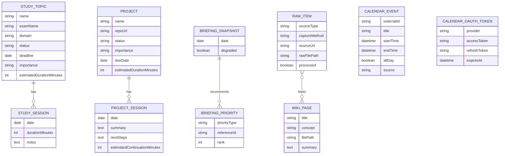

# Data Model (Rough Draft)

This is a rough entity/relationship sketch — enough to draw NestJS module
boundaries around real nouns instead of guesses. `CalendarEvent`,
`BriefingSnapshot`, `CalendarOAuthToken`, `StudyTopic`, and `Project` are
now implemented as real Prisma models (Phase 1). The remaining entities
below are still design-only — formalized in Prisma as each later phase
actually needs them.

**Non-goals for v1:** no multi-user modeling (single implicit user, no `User`
table), no `Settings` table yet — configuration lives in `.env` until there's
a real reason to move it into the database.

## Entities

### CalendarEvent
Synced from Google Calendar. Read-mostly; not the system's source of truth
(Google is).
- `externalId`, `title`, `startTime`, `endTime`, `allDay`, `isRecurring`
- `source` (e.g. `google_calendar`), `lastSyncedAt`

### BriefingSnapshot
One generated briefing (on-demand, per ADR-003 / ADR-010).
- `date`, `generatedAt`
- `degraded` (bool), `degradedReason` (nullable — which section was
  stale/missing)

### BriefingPriority
The ranked list of what a given briefing recommended. Polymorphic join
between a snapshot and whatever it's recommending (a StudyTopic or a
Project), so the briefing doesn't need to embed full copies of either.
- `priorityType` (`study_topic` | `project`)
- `referenceId`
- `rank`

### StudyTopic
Manually entered (ADR-011) — no Moodle/syllabus scraping. Full CRUD via
`StudyModule`.
- `name`, `examName` (e.g. "CompTIA Security+"), `domain` (e.g. "3.2")
- `status` (`not_started` | `in_progress` | `done`), `deadline` (nullable)
- `notes`
- `importance` (`low` | `medium` | `high`, defaults to `medium`)
- `estimatedDurationMinutes` (nullable — expected time to complete the topic)

### StudySession
A logged study block against a topic.
- `studyTopicId`, `date`, `durationMinutes`, `notes`

### Project
A tracked coding project (Project Memory). Full CRUD via `ProjectsModule`.
- `name`, `repoUrl`, `status` (`active` | `paused` | `done`), `description`
- `importance` (`low` | `medium` | `high`, defaults to `medium`)
- `dueDate` (nullable)
- `estimatedDurationMinutes` (nullable — expected time to complete the project)

### ProjectSession
One recorded coding session — the core of "resume where I left off."
- `projectId`, `date`
- `summary` (completed work), `problems`, `filesEdited` (list)
- `nextSteps`, `estimatedContinuationMinutes`

### RawItem
Anything landing in the vault's `raw/` folder (ADR-008) — whether captured
by the Telegram Capture Bot (ADR-009) or a later batch import (GitHub,
YouTube, PDF).
- `sourceType` (`tiktok` | `instagram` | `screenshot` | `text` | `github` |
  `youtube` | `pdf` | `obsidian_note` | `other`)
- `captureMethod` (`capture_bot` | `batch_import` | `manual`)
- `sourceUrl` (nullable), `rawFilePath` (path within vault `raw/`)
- `capturedAt`, `processed` (bool)

### WikiPage
An agent-maintained page in the vault's `wiki/` folder (ADR-008). One source
can trigger writes to several pages; one page can draw on several sources —
many-to-many with RawItem.
- `title`, `concept`, `filePath`, `lastUpdatedAt`, `summary`

### CalendarOAuthToken
- `provider`, `accessToken`, `refreshToken`, `expiresAt`, `createdAt`

## Relationships

`CalendarEvent` isn't wired to anything else via foreign key — it feeds
`BriefingSnapshot`'s free-time calculation at generation time, computed, not
stored as a relationship.

## Open questions for later phases

- Should `RawItem` ever link back to a `Project` or `StudyTopic` (e.g. "this
  saved article relates to this project")? Not needed for v1 — avoid
  over-modeling before there's a real retrieval use case.
- `WikiPage` ↔ `RawItem` many-to-many will need an actual join table
  (`WikiPageSource` or similar) once this gets formalized in Prisma.
